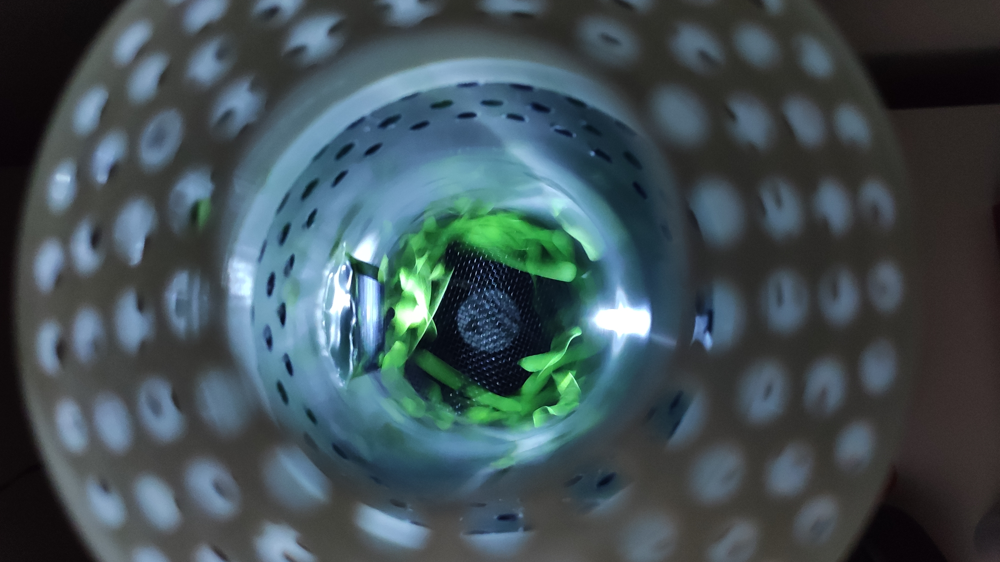

#  🎲 True Random Number Generator (TRNG) with PTG.2 Quality

Welcome to our GitHub page for the True Random Number Generator (TRNG) with PTG.2 quality standard. To ensure the quality of the random numbers, a creative noise source must be selected for each project, and the resulting random numbers must be digitized and processed according to the PTG.2 quality standard. The TRNG project includes three main components:

- **[NodeMCU: Sensor Data Sender](02-Microcontroller):** An Arduino sketch written in C++ for a NodeMCU development board that controls an LED and a fan, reads analog sensor data, and sends this data over a serial interface.
- **[Backend: Python Flask API](03-API):** A Python Flask API that supports system control, generates random numbers, and supports file downloads.
- **[Frontend: Angular Single-Page Application](04-Frontend):** An Angular Single-Page Application (SPA) that provides a user interface for system control, generating random numbers, and downloading files.

Each of these components has its own README file detailing its purpose, installation instructions, and usage. This README file serves as an overview of the entire project, and provides navigation to the individual component README files for more detailed instructions.

## ⭐ Features

The TRNG includes the following features:

- **System Control**: Ability to initialize, shut down, and restart the system.
- **Generate Random Numbers**: Generate random numbers based on user-provided parameters (number of bits and quantity).
- **Download Files**: Generate downloadable files of random numbers by specifying the number of bits and file type (binary or text).
- **Hardware Control and Data Transmission**: Ability to control an LED and a fan, read analog sensor data, and send this data over a serial interface using a NodeMCU board.

## 🛠️ Installation

Each component of the TRNG has its own installation instructions. Please refer to the individual README files for detailed installation steps:

- [NodeMCU: Sensor Data Sender  - Installation Instructions](02-Microcontroller#%EF%B8%8F-installation)
- [Backend: Python Flask API - Installation Instructions](03-API#%EF%B8%8F-installation)
- [Frontend: Angular Single-Page Application - Installation Instructions](04-Frontend#%EF%B8%8F-installation)

---

###  📸 Pictures

---

### 📖 License

This project is licensed under the MIT License. See the [LICENSE](LICENSE) file for details.
